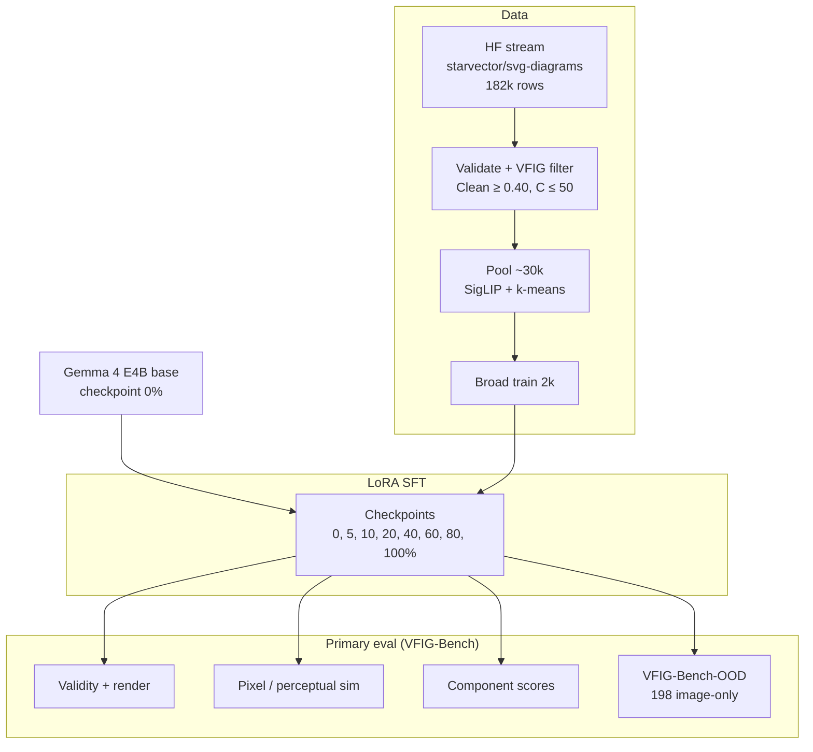
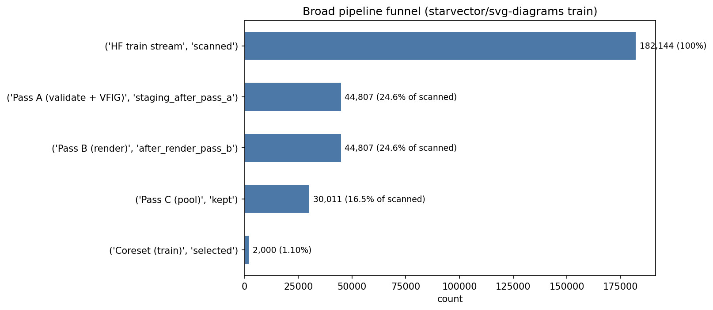
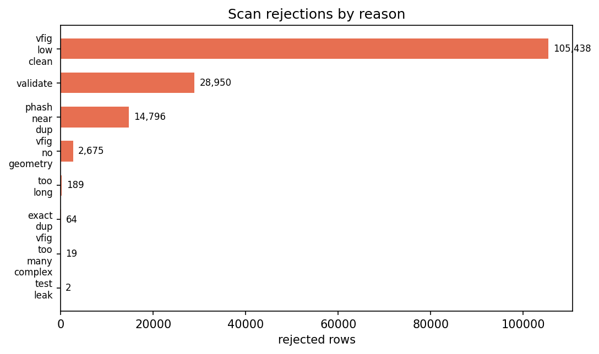
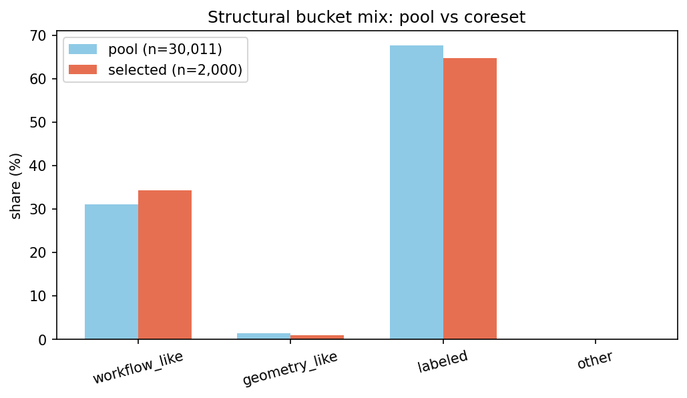
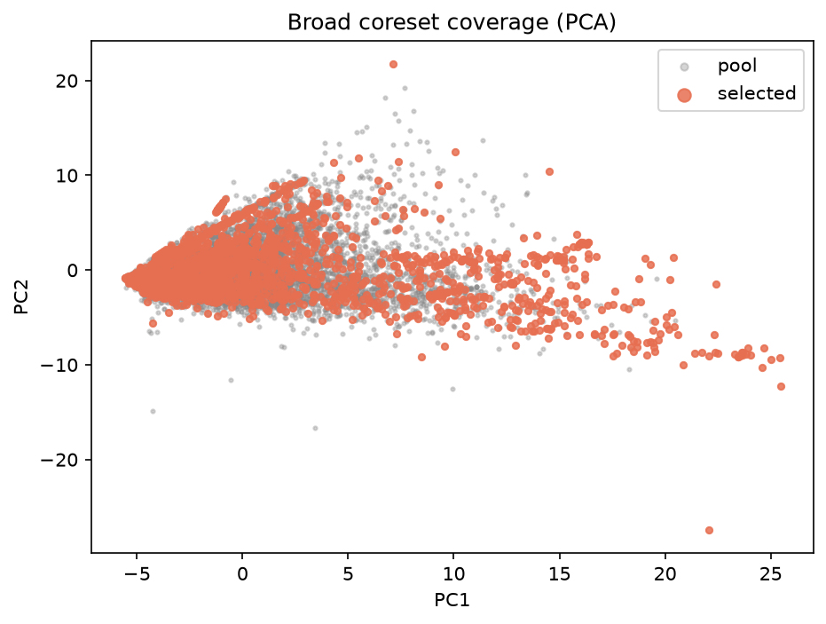
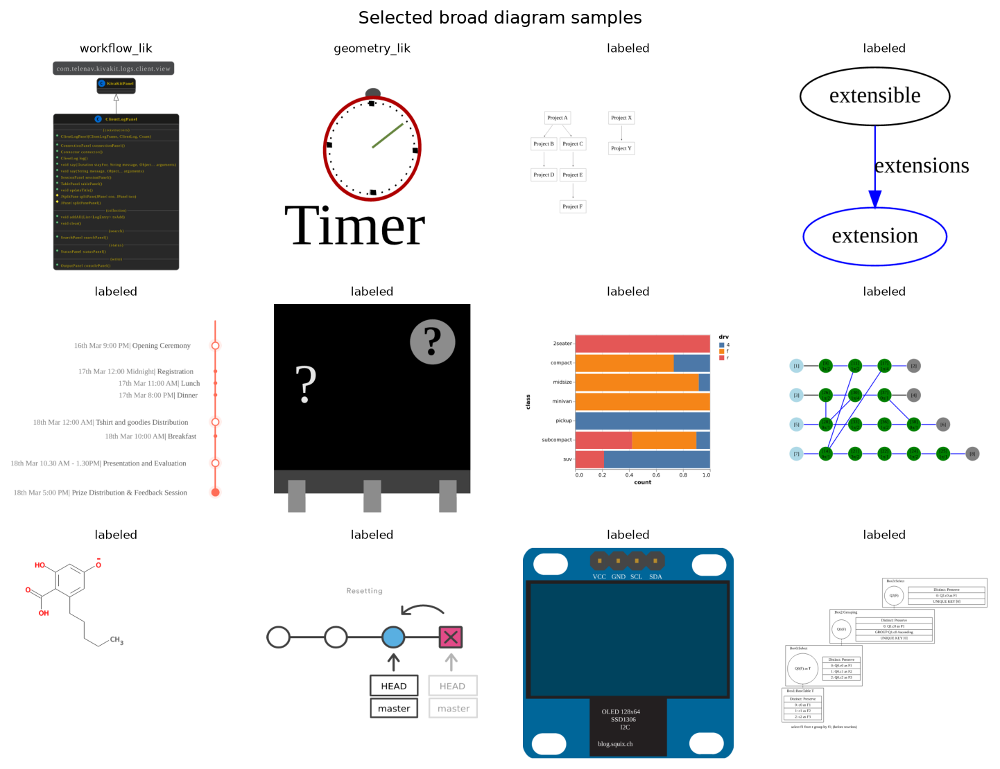

# Pretrain2Posttrain Workshop, NeurIPS 2026

Does SFT on a multimodal base VLM teach **valid SVG first**, and **diagram structure** (entities, connections, layout) only later?

This repo is the code and data for a short paper aimed at the NeurIPS 2026 workshop [*Transitioning from Pre-Training to Post-Training*](https://pretrain2posttrain.github.io/call.html).

The setup is deliberately small. **Gemma 4 E4B base**, LoRA SFT on a **2k broad-diagram coreset** from [starvector/svg-diagrams](https://huggingface.co/datasets/starvector/svg-diagrams), then eval on **VFIG-Bench** (primary) plus secondary benches.

We save dense checkpoints (0, 5, 10, 20, 40, 60, 80, 100%) to see *when* syntax and structure move. **We do not train on VFIG-Data in v0** — VFIG is held-out eval. A optional **second SFT stage** (VFIG-Data 2k or sequential on the same adapter) is a follow-up ablation after broad curves exist.

**Working claim:** post-training mostly buys SVG syntax/format; compositional structure lags on hard held-out figures unless data and eval pressure it.

---

## What is done

| Piece | Status |
|-------|--------|
| Broad 2k data pipeline | Done (182k scanned → 2k train) |
| Eval harness + gold recovery | Done (fixtures); VFIG-Bench adapter next |
| Gemma E4B broad SFT + checkpoint curves | **Next** |
| VFIG-Bench eval on checkpoints | After SFT |

---

## Pipeline

End-to-end flow: broad 2k SFT, dense checkpoints, primary eval on VFIG-Bench.



Broad curation detail (Modal stages, dedup, quotas): [data/README.md](data/README.md).

---

## Broad 2k coreset

Training pairs for the heterogeneous condition. Built from the [starvector/svg-diagrams](https://huggingface.co/datasets/starvector/svg-diagrams) train split at revision `aacd39c8…` (seed 42). Scripts: [data/scripts/](data/scripts/).

| Stage | Count |
|-------|------:|
| HF train rows scanned | 182,144 |
| Pass A (validate + VFIG) | 44,807 |
| Pool after phash dedup | 30,011 |
| **Train coreset** | **2,000** |

About 1.1% of scanned rows survive to the final set. Most drops happen at the VFIG cleanliness filter (path-heavy SVGs) and canonical validation; two rows were removed for overlap with the held-out test hashes.

The coreset has **687** workflow_like, **1,296** labeled, and **17** geometry_like examples. Selection upsampled workflow_like diagrams slightly relative to the pool while keeping cluster coverage via SigLIP + structural-feature medoids.

<table border="0" cellspacing="20" cellpadding="0" align="center">
  <tr>
    <td align="center" valign="top" width="50%">
      
      <br/>
      <em>Funnel: HF train stream → filtered pool → 2k coreset.</em>
    </td>
    <td align="center" valign="top" width="50%">
      
      <br/>
      <em>Where rows drop out before selection.</em>
    </td>
  </tr>
  <tr>
    <td align="center" valign="top" width="50%">
      
      <br/>
      <em>Pool vs selected bucket mix.</em>
    </td>
    <td align="center" valign="top" width="50%">
      
      <br/>
      <em>SigLIP + structural features: pool (gray) vs selected (color).</em>
    </td>
  </tr>
</table>

<p align="center">
  
  <br/>
  <em>Random samples from the 2k train set (960×960 letterboxed PNGs).</em>
</p>

Processed outputs are written to `data/processed/svg_diagrams/` (gitignored). See [data/README.md](data/README.md) for Modal commands and how to regenerate these plots.

---

## Evaluation

Code: [structsvg_lib/](structsvg_lib/) (parse, render, metrics) and [eval/](eval/). See [eval/README.md](eval/README.md) for the full bench list.

| Bench | What it measures |
|-------|------------------|
| **VFIG-Bench (400)** | Validity, render, pixel/perceptual sim, VFIG component + VLM-judge structure scores |
| **VFIG-Bench-OOD (198)** | Generalization on unseen figures (no gold SVG; judge + validity) |
| **SVG-Diagrams test (~474)** | DINO / perceptual comparability (secondary) |
| **Controls** | Correct vs shuffled vs blank image |

Generations are cached once; metrics can be rescored without re-running the model.

```bash
python -m eval.gold_recovery
```

---

## Training (next)

Local smoke: E2B QLoRA on 8GB ([configs/train_e2b_qlora_smoke.yaml](configs/train_e2b_qlora_smoke.yaml)). Full runs: E4B LoRA on Modal ([train/modal_app.py](train/modal_app.py), [configs/train_e4b_broad.yaml](configs/train_e4b_broad.yaml)).

Loss is CE on **target SVG tokens only** (image + prompt masked). Checkpoints are saved at fixed fractions of the matched 2k schedule.

---

## Repo layout

```text
notes/          research statement, experiment card, canonical SVG spec
configs/        train / eval YAML
data/           schemas, broad scripts, VFIG eval adapter (planned)
train/          LoRA SFT + Modal entrypoints (`train/modal_app.py`)
eval/           runners, checkpoint curves
structsvg_lib/  shared SVG parse/render/metrics (library name; not the dropped dataset)
paper/          draft
assets/         README figures (from broad analysis)
```

More detail: [notes/research_statement.md](notes/research_statement.md), [notes/experiment_card.md](notes/experiment_card.md), [notes/canonical_svg.md](notes/canonical_svg.md).

---

## Setup

```bash
python -m venv .venv
# Windows: .venv\Scripts\activate
pip install -r requirements.txt
```

You need Gemma 4 **base** accepted on Hugging Face, `HF_TOKEN` set, and Modal secret `huggingface-secret` for cloud runs.

### Quick commands

```bash
# Broad analysis plots (if processed data is local)
python -m data.scripts.broad_analyze --out data/processed/svg_diagrams

# Broad train dry-run
python -m train.lora_sft --config configs/train_e4b_broad.yaml --dry-run

# Modal E4B smoke + train
modal run train/modal_app.py --task smoke
modal run train/modal_app.py --task train --config train_e4b_broad.yaml
```

---

## Related work

- **StarVector / SVG-Diagrams** - broad data source; we study post-training timing, not leaderboard scores.
- **VFIG** (He et al., 2026) - code filter for broad pool; structure-aware eval inspiration.
- **FlowGen** - external topology benchmark (planned).
- **LIMA / Chu** - claim style and ID/OOD framing.

---

## Citation

Paper draft: [paper/draft.md](paper/draft.md). Citation block will go here after submission.

If you use the broad curation scripts, please cite this repo once the workshop paper is public.
