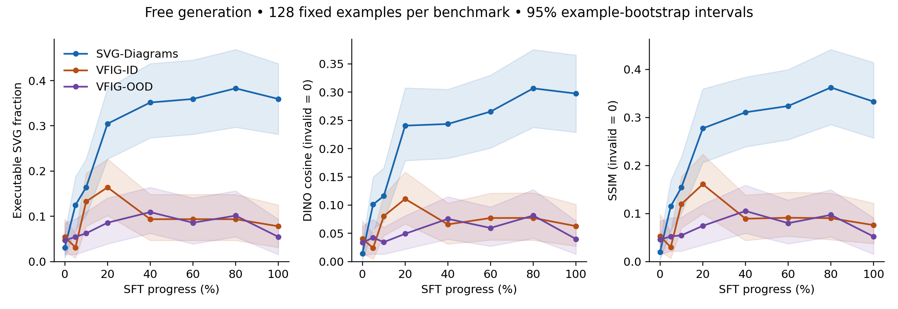
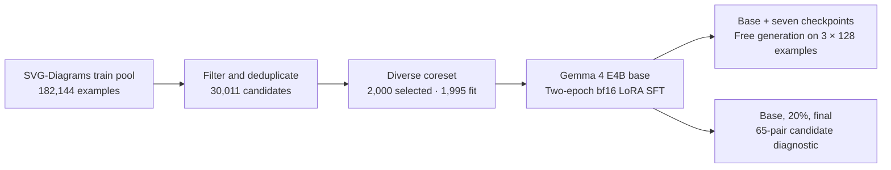

# What Changes During SVG Fine-Tuning?

### Separating Visual Discrimination from Executable Generation

Research code for our submission to the **NeurIPS 2026 workshop, Transitioning from Pre-Training to Post-Training**.

[Manuscript source](paper/neurips2026/main.tex) · [Paper and figures](paper/README.md) · [Data](data/README.md) · [Training](train/README.md) · [Evaluation](eval/README.md)

**What does supervised fine-tuning change when a model reconstructs diagrams as SVG?** We follow pretrained Gemma 4 E4B through one broad-data LoRA run and separate two behaviors: generating executable SVG and discriminating between supplied, valid SVG candidates.

**Main finding:** SFT improves executable generation on held-out examples from the training source, with no reliable final validity gain on external scientific figures. Candidate matching changes little. The checkpoint curves **do not support a simple syntax-first account**.

## Results

Free generation uses the same **128 examples per benchmark** at the base and seven SFT checkpoints: **3,072 generations** in total. These are subset results, not full-benchmark scores.

- **SVG-Diagrams, held-out source data:** executable validity increases from **3.1% to 35.9%**. The paired gain is **32.8 percentage points**, with a 95% bootstrap interval of **[24.2, 41.4]**. DINO similarity increases from **0.014 to 0.298**.
- **External scientific figures:** final validity changes from **5.5% to 7.8%** on VFIG-ID and **4.7% to 5.5%** on VFIG-OOD. Both paired gain intervals include zero. “ID” is VFIG's split name; both VFIG subsets are external to our training source.
- **Learning timing:** source-distribution validity, DINO, and SSIM reach half of their observed base-to-final gain at the **20% checkpoint**. Validity does not lead fidelity at this checkpoint resolution.
- **Supporting counterfactual diagnostic:** strict image–SVG matching changes from **19/65 to 20/65** pairs. At the final checkpoint, **14 of the 20** successfully matched sources still produce invalid SVG in free generation.



*Free generation across the base and seven SFT checkpoints. Invalid outputs receive zero DINO and SSIM, so these fidelity scores partly depend on executable validity. [Vector figure](paper/neurips2026/figures/svg_probe_generation_curves.pdf).*

## Experiment

The task is **diagram image → native SVG**. The model receives the image and a fixed reconstruction prompt; its completion contains SVG markup.

- **Model:** `google/gemma-4-E4B`, pretrained base checkpoint.
- **Training data:** 2,000 curated SVG-Diagrams pairs; five fail the complete-sequence length gate, leaving **1,995 SFT pairs**. No VFIG data is used for training.
- **SFT:** frozen bf16 base with bf16 LoRA adapters; rank 16, alpha 32, dropout 0.05, all linear modules. Target-SVG-only cross-entropy, two epochs, learning rate `1e-4`, effective batch size 8, 8,192-token context, 500 optimizer steps.
- **Trajectory:** unchanged base/0%, then adapters at 5, 10, 20, 40, 60, 80, and 100%. The `final` adapter duplicates 100%.
- **Generation:** greedy decoding, 4,096 output tokens, fixed seed-42 subsets of SVG-Diagrams, VFIG-ID, and VFIG-OOD.
- **Candidate diagnostic:** 65 visually inspected original/edited pairs, evaluated at base, 20%, and final. Equal-token SVG candidates test text, box-position, connector-endpoint, and combined edits; white and unrelated images serve as controls.

The submitted run uses [train_e4b_broad_v2.yaml](configs/train_e4b_broad_v2.yaml). The earlier broad config and E2B QLoRA smoke config are retained for development history.



## Interpretation and limitations

This is **one model, one SFT run, and one training source**. It measures a distribution-dependent change in executable behavior; it does not establish that SFT creates general diagram understanding or identify the contents of pretraining.

Invalid outputs receive zero end-to-end fidelity, coupling validity and similarity. The candidate probe supplies valid alternatives and measures discrimination under teacher forcing, not free reconstruction. Its small, constructibility-filtered edit groups do not establish a general ranking of visual skills.

Training and inference used different stopping-token conventions. Final output-limit rates are 62.5% on SVG-Diagrams, 92.2% on VFIG-ID, and 94.5% on VFIG-OOD; these failures may partly reflect that protocol mismatch. A controlled stopping-token ablation is needed before attributing them entirely to model capability.

## Getting started

Python **3.10+** is declared in the package; Modal images use **Python 3.11**. Run commands from the repository root.

```bash
python -m venv .venv
# Linux/macOS: source .venv/bin/activate
# Windows PowerShell: .venv\Scripts\Activate.ps1
python -m pip install -r requirements.txt
python -m pytest -q
```

The requirements include the GPU training stack. Gemma access requires accepting its Hugging Face access terms and configuring `HF_TOKEN`; Modal jobs additionally use the `huggingface-secret` secret. See [training setup](train/README.md) for data-volume preparation and explicit v2 commands.

After preparing the broad data locally:

```bash
python -m train.lora_sft --config configs/train_e4b_broad_v2.yaml --dry-run
```

This checks manifest loading and previews the first eight pairs. The exact processor-based sequence-length gate runs during training setup; the dry-run alone does not certify all 1,995 complete sequences.

## Reproducibility and artifact availability

**Included in Git:** curation, training, inference and evaluation code; YAML configurations; unit tests; manuscript LaTeX and bibliography; paper PDF figures; README preview images.

**Excluded from Git:** processed datasets, selected/evaluation manifests, adapters, tokenizers, cached generations, raw probe scores, and analysis outputs under `outputs/`. A fresh clone supports code inspection and tests, but does not contain the evidence bundle needed to reproduce the reported numbers directly. No public checkpoint or evidence-download URL is recorded here yet.

The [evaluation README](eval/README.md#reproducing-the-submitted-analysis) identifies expected evidence paths and remaining dependencies. Dependencies use version ranges and the model config uses `revision: main`; these are not an immutable environment lock. Exact replay requires the original model revision, environment versions, frozen subsets, and run artifacts.

## Repository guide

- [data/](data/) — source adapters, curation, deduplication, manifests, and coreset analysis.
- [train/](train/) — target-only multimodal SFT, checkpoint inference, vLLM, and Modal entrypoints.
- [eval/](eval/) — cached-generation scoring, checkpoint analysis, counterfactual construction and likelihood scoring.
- [structsvg_lib/](structsvg_lib/) — shared SVG parsing, rendering, and metrics. The package name is historical; the submitted experiment does not use a synthetic StructSVG dataset.
- [configs/](configs/) — model, data, and training settings.
- [tests/](tests/) — SVG, metric, curation-feature, and probe tests.
- [paper/](paper/) — current manuscript source and earlier draft history.
- [notes/](notes/) — planning and decisions; some notes describe superseded experiments. Use the manuscript and v2 config for the reported study.

## Data sources and attribution

The broad coreset comes from [StarVector's SVG-Diagrams dataset](https://huggingface.co/datasets/starvector/svg-diagrams). VFIG supplies the scientific-figure evaluations and informs the geometry-cleanliness filter. Full scholarly references are in the [manuscript bibliography](paper/neurips2026/references.bib). Curation counts, provenance, sample images, and regeneration commands are documented in [data/README.md](data/README.md).

## Paper, citation, and licensing

**Submission:** *What Changes During SVG Fine-Tuning? Separating Visual Discrimination from Executable Generation*, submitted to the NeurIPS 2026 workshop *Transitioning from Pre-Training to Post-Training*. This records submission, not acceptance.

The checked-in manuscript retains anonymous author metadata. A public paper link and author-complete citation will be added when available; see [paper/README.md](paper/README.md) for the current source.

No repository-level license file is currently included. Source datasets and Gemma retain their respective licenses and access conditions; this repository does not relicense them.
