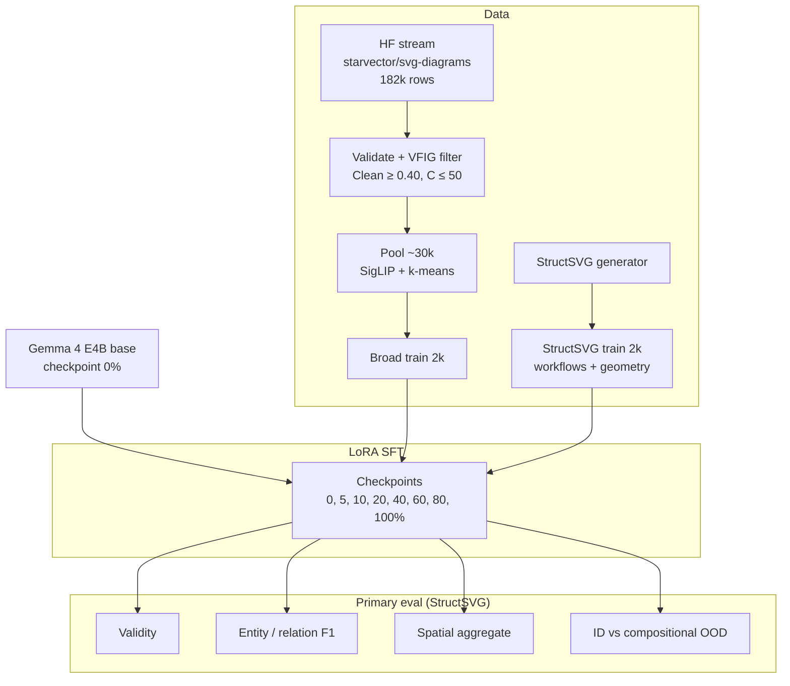

# Pretrain2Posttrain

Does SFT on a multimodal base VLM teach **valid SVG first**, and **diagram structure** (entities, connections, layout) only later?

This repo is the code and data for a short paper aimed at the NeurIPS 2026 workshop *[Transitioning from Pre-Training to Post-Training](https://pretrain2posttrain.github.io/call.html)*.

The setup is deliberately small and matched. **Gemma 4 E4B base**, LoRA SFT only, two 2k training conditions with similar token budgets:

1. **Broad** - heterogeneous public diagrams from `starvector/svg-diagrams`, filtered and coreset-selected.
2. **StructSVG** - controlled workflows + geometry with gold scene graphs and a compositional OOD split.

Primary eval is on StructSVG (validity, typed entity/relation F1, spatial aggregates). We save dense checkpoints (0, 5, 10, 20, 40, 60, 80, 100%) to see *when* syntax and structure move. VFIG-Bench is secondary eval only; we borrowed their code filter for broad curation but do not train on VFIG-Data in v0.

**Working claim:** post-training mostly buys SVG syntax/format; compositional structure lags unless the data and eval are built for it.

---


## What is done


| Piece                             | Status                         |
| --------------------------------- | ------------------------------ |
| Broad 2k data pipeline            | Done (182k scanned → 2k train) |
| Eval harness + gold recovery      | Done                           |
| StructSVG generator               | Pilot manifests; full 2k next  |
| Gemma E4B SFT + checkpoint curves | In progress                    |


---


## Pipeline

End-to-end flow for the workshop study: two matched 2k SFT conditions, dense checkpoints, structure-first eval on StructSVG.




Broad curation detail (Modal stages, dedup, quotas): `[data/README.md](data/README.md)`.

---


## Broad 2k coreset

Source: Hugging Face `[starvector/svg-diagrams](https://huggingface.co/datasets/starvector/svg-diagrams)`, pinned revision `aacd39c8…`, seed 42.

Pipeline: validate canonical SVG → **VFIG code filter** (Clean = (B+K)/N ≥ 0.40, C ≤ 50) → render + perceptual hash → dedup vs ~442 test hashes → SigLIP embed → MiniBatchKMeans medoids with difficulty/rare quotas.


| Stage                    | Count     |
| ------------------------ | --------- |
| HF train rows scanned    | 182,144   |
| Pass A (validate + VFIG) | 44,807    |
| Pool after phash dedup   | 30,011    |
| **Train coreset**        | **2,000** |


Most rejections are `vfig_low_clean` (path-heavy SVGs) and `validate` (parse/canonical bounds). Two rows blocked for test leakage.

Selected bucket mix: **687** workflow_like, **1,296** labeled, **17** geometry_like. Median difficulty ≈ 18.7 (p90 ≈ 73.4).

  
*Funnel: HF train stream → filtered pool → 2k coreset.*

  
*Where rows drop out before selection.*

  
*Pool vs selected bucket mix (workflow_like upsampled slightly).*

  
*SigLIP + structural features: pool (gray) vs selected (color).*

  
*Random samples from the 2k train set (960×960 letterboxed PNGs).*

Processed outputs live under `data/processed/svg_diagrams/` (gitignored). See `[data/README.md](data/README.md)` for the full pipeline and Modal commands.

---


## Evaluation

Code: `structsvg_lib/` (parse, render, scene-graph extract, metrics) + `eval/`.


| Metric                  | Role                                              |
| ----------------------- | ------------------------------------------------- |
| Validity                | XML parse + render + canonical profile (syntax)   |
| Entity / relation F1    | Typed scene-graph match                           |
| Spatial aggregate       | Workflow reachability; geometry relation accuracy |
| ID vs compositional OOD | Structure generalization                          |
| DINO                    | Secondary perceptual                              |
| Controls                | Correct / shuffled / blank image                  |


Generations are cached once; metrics can be rescored without re-running the model.

```bash
python -m eval.gold_recovery
```

---


## Training (next)

Local smoke: E2B QLoRA on 8GB (`configs/train_e2b_qlora_smoke.yaml`). Full runs: E4B LoRA on Modal (`train/modal_app.py`, `configs/train_e4b_broad.yaml`).

Loss is CE on **target SVG tokens only** (image + prompt masked). Checkpoints are saved at fixed fractions of the matched 2k schedule.

---


## Repo layout

```text
notes/          research statement, experiment card, canonical SVG spec
configs/        train / eval YAML
data/           schemas, broad + StructSVG scripts
train/          LoRA SFT + Modal entrypoints
eval/           runners, rubrics, fixtures
structsvg_lib/  shared SVG + graph + metrics
paper/          draft
assets/         README figures (from broad analysis)
```

More detail: `[notes/research_statement.md](notes/research_statement.md)`, `[notes/experiment_card.md](notes/experiment_card.md)`.

---


## Setup

```bash
python -m venv .venv
# Windows: .venv\Scripts\activate
pip install -r requirements.txt
```

You need Gemma 4 **base** accepted on Hugging Face, `HF_TOKEN` set, and Modal secret `huggingface-secret` for cloud runs.

### Quick commands

```bash
# StructSVG pilot
python -m data.scripts.generate_structsvg --pilot

# Broad analysis plots (if processed data is local)
python -m data.scripts.broad_analyze --out data/processed/svg_diagrams

# Local train smoke
python -m train.lora_sft --config configs/train_e2b_qlora_smoke.yaml --dry-run

# Modal broad pipeline (full scan)
modal run data/scripts/modal_broad_app.py --stage all
```

---


## Related work

- **StarVector / SVG-Diagrams** - broad data source; we study post-training timing, not leaderboard scores.
- **VFIG** (He et al., 2026) - code filter for broad pool; structure-aware eval inspiration.
- **FlowGen** - external topology benchmark (planned).
- **LIMA / Chu** - claim style and ID/OOD framing.

---


## Citation

Paper draft: `[paper/draft.md](paper/draft.md)`. Citation block will go here after submission.

If you use the broad curation scripts or StructSVG generator, please cite this repo once the workshop paper is public.