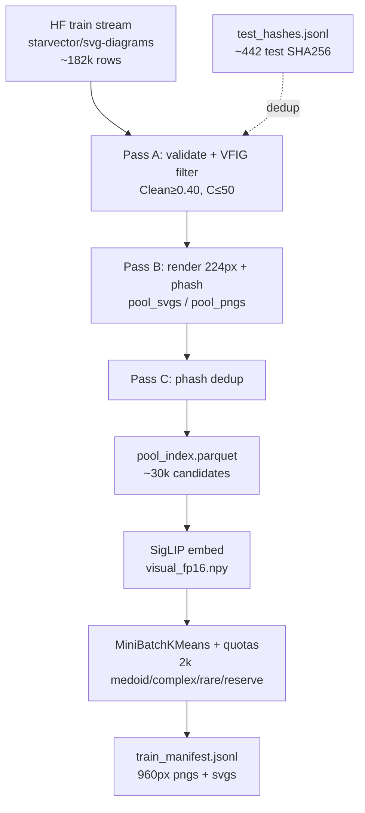

# Data

## Layout

```text
data/
  scripts/          download, filter, manifest, and analysis utilities
  raw/              downloaded public data (gitignored)
  processed/        manifests + rendered pairs (gitignored)
    broad/          pilot / scratch (Modal volume mirror)
    svg_diagrams/   full broad 2k coreset (Aug 2026)
    vfig_bench/     VFIG-Bench eval manifests (planned)
  splits/           fixed split IDs when needed
```

## Public preview (optional)

```bash
python -m data.scripts.preview_public_svg
```

Then open `data/processed/public_preview/gallery.html` in a browser.

## Broad 2k coreset pipeline (Phase A)

**Full run output:** `data/processed/svg_diagrams/` (2k train pairs from `starvector/svg-diagrams`).

### Pipeline (Modal recommended for ~182k scan)




**VFIG code filter** (He et al. 2026): drop SVGs with semantic cleanliness (B+K)/N < 0.40 or complex shapes C > 50 where: B= no. of rect/circle/ellipse, K=no. of line/polyline, C=no. of path/polygon.

### Full run stats (locked run, seed 42)


| Stage                    | Count      |
| ------------------------ | ---------- |
| Scanned                  | 182,144    |
| Pass A survivors         | 44,807     |
| Pool (after phash dedup) | **30,011** |
| Train coreset            | **2,000**  |


Top rejections: `vfig_low_clean` 105,438 · `validate` 28,950 · `phash_near_dup` 14,796.

**Pool buckets:** labeled 20,304 · workflow_like 9,297 · geometry_like 410.

**Selected buckets:** labeled 1,296 · workflow_like 687 · geometry_like 17.

Analysis plots + auto summary:

```bash
python -m data.scripts.broad_analyze --out data/processed/svg_diagrams
# → figures/analysis/*.png, RUN_SUMMARY.md
```

### Commands

```bash
# 0) Test-split dedup hashes
python -m data.scripts.build_test_hashes

# 1) Pilot (~5k scan → ~1k pool → 40 coreset)
python -m data.scripts.broad_scan_pool --pilot
python -m data.scripts.broad_embed --pilot --fresh
python -m data.scripts.broad_select_coreset --pilot
python -m data.scripts.broad_visualize --pilot

# 2) Local full stages (after pilot gates)
python -m data.scripts.broad_scan_pool
python -m data.scripts.broad_embed --fresh
python -m data.scripts.broad_select_coreset
python -m data.scripts.broad_visualize

# 3) Modal (recommended)
modal run data/scripts/modal_broad_app.py --stage all --pilot
modal run data/scripts/modal_broad_app.py --stage all --fresh-embed

# Download full run from volume
modal volume get structsvg-data broad/train_manifest.jsonl data/processed/svg_diagrams/
modal volume get structsvg-data broad/pngs data/processed/svg_diagrams/
modal volume get structsvg-data broad/svgs data/processed/svg_diagrams/
modal volume get structsvg-data broad/scan_stats.json data/processed/svg_diagrams/
modal volume get structsvg-data broad/selection_stats.json data/processed/svg_diagrams/

# Gates (local copy — select-only if intermediates not downloaded)
python -m data.scripts.broad_checks --stage select --out data/processed/svg_diagrams
python -m data.scripts.broad_checks --stage all --out data/processed/svg_diagrams \
  --fig-dir data/processed/svg_diagrams/figures/figures
```

**Train config:** `configs/train_e4b_broad.yaml` → `data/processed/svg_diagrams/train_manifest.jsonl`.

Set `BROAD_TQDM=0` to disable progress bars (e.g. in CI).

## Conditions


| Condition        | Train source                                      | Role                                           |
| ---------------- | ------------------------------------------------- | ---------------------------------------------- |
| **Broad 2k**     | Coreset from `starvector/svg-diagrams` train pool | v0 SFT — heterogeneous real diagram SVG syntax |
| **VFIG-Data 2k** | Optional 2nd-stage coreset from `QijiaHe/VFIG-Data` | Follow-up ablation only; dedup vs Broad + VFIG-Bench 400 |


**Primary eval (no train):** VFIG-Bench 400 + VFIG-Bench-OOD 198, SVG-Diagrams test (~474), controls.

Do not commit raw HF dumps, large PNG grids, or model outputs.

## VFIG data — where it fits (and where it does not)

[VFIG](https://arxiv.org/abs/2603.24575) released **VFIG-Data** (~66k image–SVG pairs on HF `QijiaHe/VFIG-Data`) and **VFIG-Bench** (held-out scientific figures). We do **not** fold VFIG into the completed Broad 2k run; it remains evaluation data unless a later experiment is explicitly started.


| Use                                     | v0 (Aug 29)                                                                                              | Later                                                                  |
| --------------------------------------- | -------------------------------------------------------------------------------------------------------- | ---------------------------------------------------------------------- |
| **VFIG-Bench eval**                     | **Primary** — score base + broad-SFT checkpoints on 400 ID + 198 OOD | Workshop comparability to VFIG paper |
| **VFIG-Data as 2nd-stage train**        | Optional after broad curves — 2k coreset, exclude VFIG-Bench IDs       | Ablation: does structure data move structure metrics? |
| **VFIG-Data-Shapes-and-Arrows** (~6.5k) | Optional curriculum slice for 2nd stage                               | Closest to VFIG stage-1 primitives |
| **Cross-dedup**                         | Required before any VFIG train use                                    | Same phash + test-hash pipeline as broad |

**Recommended v0 path:** broad 2k SFT → checkpoint eval on **VFIG-Bench** (+ OOD) → optional 2nd-stage VFIG SFT ablation.

Adapter script (planned): `data/scripts/vfig_to_manifest.py` — render figures, normalize to `notes/canonical_svg.md`, emit eval manifest only.
